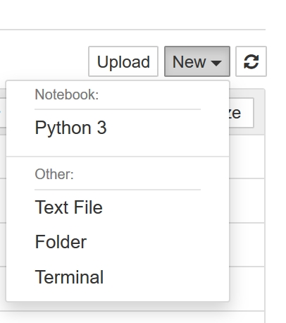
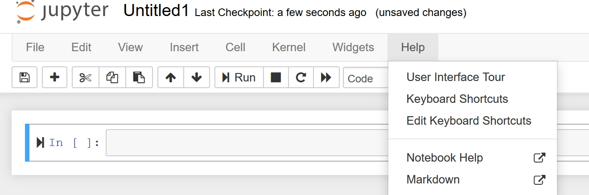

# Introduction to Python

## Before the practical

1. Download and install Python 3
2. Download and install Jupyter notebook
3. Attend intro lecture (11.00, Tue 16th October, Maxwell Centre)

### Python 3

Follow the instructions below to install the latest version of Python (3.7.0).

1. Go to https://www.python.org/downloads/
2. Download Python 3.7.0 by clicking the yellow button at the top of the page.
3. Download and open the .exe file
4. On the first window, tick the box at the bottom of the window "Add Python 3.7 to PATH". Then select "Install Now" (unless you're already familar with Python and want to customise the installation).
5. Complete installation

###Check Python is installed

1. Open "Run" (press the Windows key and then R or type "run" in the Windows start menu)

2. Type "cmd.exe" into "Run" to open the Windows Command Prompt (white text on a black background)

   

3. Type "python" (lower case) on the first line. 

4. If Python's installed you should see "Python 3.7.0" pop up on screen.

### Jupyter Notebook

Jupyter notebooks are a neat way of combining text notes and pieces of code (in Python or other programming languages). They are similar to Wolfram Mathematica notebooks, if you've seen those. See http://jupyter.org/ for more info.

Incidentially, this is not the only way to write code with Python, and we will discuss some alternatives in the intro lecture.

We will install Jupyter Notebook using a tool called pip ( https://pypi.org/project/pip/) which makes it easy to install packages (extensions) of the core Python language. Pip was automatically installed when you installed Python.

1. Go to the Windows Command Prompt (see instructions above)

2. Type the following into the command prompt:

   ```python
   python -m pip install jupyter
   ```

3. It should take a few minutes to download all the necessary components
4. To run Jupyter notebook, open the Command Prompt and type 

```
jupyter notebook
```

If successful, a new window should open:


5. Navigate to a folder (e.g. Documents)

6. Click "New" in the top right corner and select "Python 3" to create a new notebook in that folder.

    

7. A new blank notebook should now be open. Under the "Help" tab at the top of the page, you can take a tour of the Jupyter user interface, and learn more about other features (e.g. keyboard shortcuts).

8. Play around with Jupyter notebooks to familiarise yourself (see example notebook SimpleHistogram.ipynb in the email).