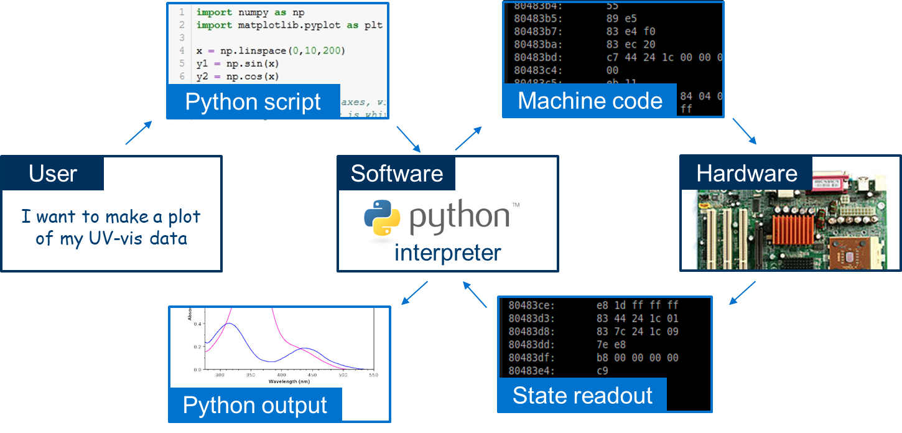
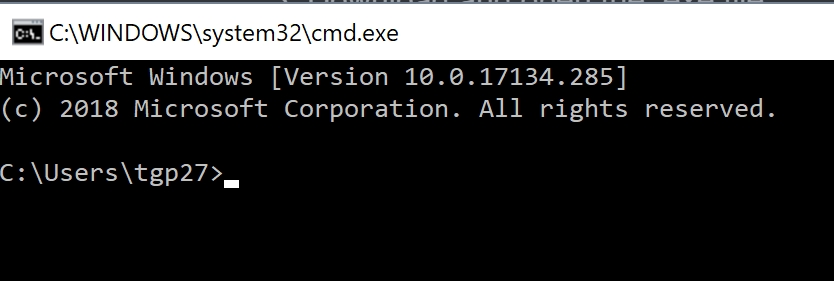

# Introduction to Python Practical

Michaelmas 2018

Thomas Parton [tgp27@cam.ac.uk ](mailto:tgp27@cam.ac.uk )

## Introduction

### What is Python?

Python is an open-source programming language. The user creates a script (a series of text expressions organised into lines representing a single piece of code in the form of a .py file) which is passed to the Python interpreter (the software you install). The interpreter converts the code (a language you understand) into machine code (a language the hardware of your computer understands). The hardware performs the necessary operations, and reads out the result. The interpreter then converts this back into the desired output.



Note that "Python" refers to two separate but closely-related things: the *programming language* used to write scripts, and the *interpreter* that uses them. You write a code *in Python* which is interpreted *by Python*. 

###Why choose to learn Python?

Here are some commonly-stated advantages of Python:

##### It’s easy to use

- Free and open-source
- Relatively easy to learn (compared to other languages)
- Readable code (high-level language)
- Robust and error-tolerant

##### It's powerful

- Versatile (multiple programming paradigms)
- Extensible (easy to upgrade what it can do

##### It’s popular

- Active online support community 
- A lot of other people already use it. 

### Comparing Python to other research software

The reasons above may seem persuasive, but they largely compare Python to other programming languages. As researchers we are more interested in how using Python compares to other research software we could use instead. In particular, you may be familiar with MATLAB, Origin Lab, ImageJ and trusty old Windows Office, as well as other programs.

#### Where Python is good (but there are better options)

* Data analysis for research (OriginLab, R)

* Image processing (ImageJ)

* Modelling (MATLAB, COMSOL)

* Advanced maths (MATLAB, Mathematica)

#### So why use Python then?

Python is a universal programming language, which means that it can do almost everything pretty well, but few things extremely well (better than a specific piece of software for that purpose). However, that universality is very useful when you want to automate a series of steps, or combine together different techniques that would otherwise be in separate programs.

## Using Python

### Jupyter notebooks

For this practical we will be coding Python in [Jupyter notebooks](http://jupyter.org/). Jupyter notebooks are a neat way of combining text notes and pieces of code (in Python or other programming languages). Jupyter runs from your web browser, but does not require the internet to work. Jupyter notebooks are similar to Wolfram Mathematica or Maple notebooks, if you've seen those before.

### Other ways to use Python

Jupyter is convenient for tutorial purposes because it allows us to easily combine text, equations, figures and blocks of code. However, in practice you will probably write and implement Python in a different piece of software called an *integrated development environment* (IDE). An IDE combines a text editor (where you type in Python code) with a debugger (to check your code for errors) as well as other handy features (such as colour-coding text as you type). Here are a few popular Python IDEs (for more information, see [here](https://en.wikipedia.org/wiki/Comparison_of_integrated_development_environments#Python)):

* IDLE (integrated development and learning environment) is the standard out-of-the-box text editor that comes with Python.
* [Spyder](https://www.spyder-ide.org/) and [Atom](https://ide.atom.io/) are popular IDEs for research. 
* [Anaconda](https://www.anaconda.com/what-is-anaconda/) is a bundle that includes Python, Jupyter, Spyder and other software. Anaconda is popular in the data science community.

### Modules and packages

Many common things you may want to do using Python (e.g. plotting a given set of data) have already been written into self-contained pieces of code called *functions* grouped into [modules](https://docs.python.org/3/tutorial/modules.html). A module is a separate Python script which can be *imported* into the current script by *calling* it (referencing the module name at the top of the script).

The Python programming language comes with a [standard library](https://docs.python.org/3/library/) of modules which contain many common functions (e.g. arithmetic, sorting a list of items, storing results in a .txt file). For more advanced features (e.g. working with matrices), additional functions can be added to Python by downloading and installing *packages*. Packages are extra modules which can be downloaded (for free) and used like the modules in the standard library.

Packages can be installed using a tool called [PyPi or pip](https://pypi.org/project/pip/), a piece of software which automatically installed when you installed Python. For example, to install [pandas](https://pandas.pydata.org/) (a Python library for data analysis) we open the Command Prompt and type:

```python
python -m pip install pandas
```

## Learning Python

### First-time learners

There are many possible ways to learn Python from scratch. For Cambridge students, these include:

- [University of Cambridge courses (free)](https://www.training.cam.ac.uk/search?type=events&query=python&_action_search=Search&_pastEvents=)
- General online learning platforms such as [Coursera (££)](https://www.coursera.org/courses?languages=en&query=python+programming) or [Udemy (££)](https://www.udemy.com/courses/search/?src=ukw&q=python).
- Free online tutorials such as [the Python.org tutorial](https://docs.python.org/3/tutorial/), [SoloLearn](https://www.sololearn.com/) or other sources such as [GitHub](https://github.com/jerry-git/learn-python3/blob/master/README.md).
- Books on Python.

### Finding solutions to your Python problems

Python users at all levels of experience will encounter problems that they cannot solve immediately. Solutions can usually found in the following ways:

- Reading official manuals for [Python](https://docs.python.org/3/) and [specific packages](https://docs.scipy.org/doc/numpy/). 
- Searching online, leading to the manuals above or online forums such as [StackOverflow](https://stackoverflow.com/questions/tagged/python).
- Talking to other Python users. 

Before you start looking for a solution to your problem it is helpful if you can clearly articulate your problem, ideally using the correct Python jargon. This point may seem obvious, but it will often save you considerable time trawling through search engine results (and surprisingly often, just thinking carefully about your problem will lead you to a realisation of the solution without further information).

### Useful packages

First of all, you can see all the packages that are currently installed by opening the Command Prompt and typing

```powershell
pip list
```

New packages can be found by searching online or on the PyPI website. Be aware that not all Python packages are equal in quality. The big, popular Python packages are produced by teams of coders and thoroughly tested for bugs, whereas smaller packages may be the product of a single coder and can therefore have flaws (as well as limited technical support if things go wrong).

Comprehensive lists of packages of generic applications can be found online; I have found [this list](https://github.com/vinta/awesome-python) particularly useful. Below is a list of packages I think you will find especially useful.

#### Scientific packages

[SciPy](https://www.scipy.org/) is a bundle of packages for scientific use of Python. It includes the following packages:

- [NumPy](http://www.numpy.org), which introduces arrays and other useful mathematical features. A special introduction to NumPy for users coming from MATLAB is available [here](https://docs.scipy.org/doc/numpy/user/numpy-for-matlab-users.html).
- [Matplotlib](http://matplotlib.org/) (mathematical plotting library), a popular library for data visualisation
- [Pandas](http://pandas.pydata.org/) for data analysis
- SymPy for symbolic maths

A list of further scientific packages recommended by SciPy can be found [here](https://scipy.org/topical-software.html#head-b98ffdb309ccce4e4504a25ea75b5c806e4897b6) 

#### File and system management

- [os](https://docs.python.org/3/library/os.html) for operating system interface (e.g. getting the path to a file, create files, opening and closing files)
- [shutil](https://docs.python.org/3/library/shutil.html) for moving, copying and deleting files and folders

### Other useful packages

- [re](https://docs.python.org/3/library/re.html) for regular expressions. If you're not familiar with regular expressions (regex), they are a useful way for searching text for patterns. Here is [a tutorial](https://scotch.io/tutorials/an-introduction-to-regex-in-python), [a useful regex checking tool](https://regex101.com/) and a site for [regex crosswords](https://regexcrossword.com/).

## Good coding habits

### What makes code good?

What do you want from your code? 'Good' code can be described as

- effective (it does the task you want it to do)
- user-friendly (readable and well-commented)
- quick to write or use (so you can finish coding and get on with doing experiments)
- efficient (it does the task as quickly as possible and has no unnecessary parts)
- original (something you created yourself)

The ordering of the points here reflects the typical priorities of a coder - effective but unreadable code is better than ineffective but readable code, and so on. We will take it for granted that your code works, so the good coding habits below mainly address the user-friendliness, efficiency and originality of your code. 

### Commenting well

- Add comments to your code. It is tempting to save time by not writing comments as you go, but it makes the code much easier to read. Write code as if it will be read by stranger, because in six months' time, when you don't remember writing every line of the code, that stranger may very well be you.
- Write concise, clear comments. It doesn't have to be perfect English sentences. Say everything that needs to be mentioned and nothing else - pointless comments just clutter up the page.
- Provide useful information- summarise the purpose of a function, the data type of the inputs and outputs- anything that is not immediately obvious.

### Naming objects well

- There are [conventions for labelling objects](https://www.python.org/dev/peps/pep-0008/#naming-conventions) in Python. Stick to them.
- Give objects intuitive and consistent names (e.g. vx and vy for x and y velocity components).
- Avoid confusing or easily mistaken names: e.g. lstr might be a list (lst-r) or a string (l-str). If there's a risk of confusion, add a comment.

### Large-scale code and project structure

- Within a single script, group together similar actions (e.g. load all the .txt files together, process them together, save the outputs together)
- Organise your folder structure clearly (e.g. have the Python script in one folder, with raw data in a "rdata" subfolder, and processed data in a separate "pdata" folder).

### Other good habits

- Keep a folder of clean working blocks of code for yourself to use later (e.g. a generic plot of data, converting data types)
- Refactor your code - before closing the file, read it again, clean it up, and add comments
- Test your code as you go. Make sure each section works (by e.g. printing out the values) before moving on to the next section, instead of doing everything in one go.
- (Hopefully obvious): If an error message appears, read it carefully. It will usually point you to the source of the problem.

### Good code habits are like good lab habits

Here is a table comparing some good coding habits with good habits in the lab.

| Good coding habit                                            | Good lab habits                                              |
| :----------------------------------------------------------- | :----------------------------------------------------------- |
| Make a plan of what the code will do and break it down into individual tasks. | Make a plan of what the experiment will do and break it down into smaller tasks. |
| Label objects (e.g. functions) in a consistent way           | Label samples in a consistent way                            |
| Add concise, useful comments to make the code easier to read | Add concise, useful observations about the experiment to make the lab book easier to read |
| Don't overfill a line of code                                | Don't overfill a line of the lab book                        |
| If things are going wrong, check individual sections of code one at a time | If things are going wrong, check individual components of the equipment one at a time |

### Is it ok to copy code from the internet?

In a sentence: yes, if you do it intelligently.

If you are the author of a piece of code, you should understand every single line of code (the purpose of each line, the inputs and outputs, the data types etc.). However, that doesn't mean that you could re-write the code from memory - a lot of the minor details (such as the exact name of functions) are quite arbitrary and you are not reasonably expected to remember them all. You will almost certainly use online sources (official documentation, online forums, and others) in the process of creating new code.

'Unintelligent' copying of code is simply copying and pasting code from a website. Aside from being immoral and plagiaristic, it's a foolish approach to coding because the results you find online will rarely be an exact solution to your particular problem, and without a good understanding of what your code contains you will struggle to achieve what you want, or fix the code if anything goes wrong. Don't make a Frankenstein's monster from fragments of code copied from Stack Overflow.

'Intelligent' copying of code looks something like this:

1. Articulate your problem
2. Search for a solution online
3. Find a candidate solution, and copy it into a separate Python file.
4. Run the Python file to see if it works and it would solve your problem
5. Play with code to understand how it works. Add comments if any steps are unclear. Re-write the code to fit your particular problem and coding style
6. Add the edited code into your original file. You can also add a hyperlink to the source code in a comment, in case you want to return to it later.

By following this process you will probably end up substantially re-writing the code, and the code can therefore be considered your own work.

#### Citing code

If you use someone else's code (e.g. entire Python packages) then you can cite the code like any other work. If the code is introduced in an academic paper, then the paper can be used as a reference (see e.g. [this Nature article](https://www.nature.com/articles/nature13802) which cites matplotlib). Otherwise, it is acceptable to cite a link to the online repository of the code (such as [GitHub](https://github.com/)).

## Connecting to and from Python

###General comments

Python can connect to many other programs and interfaces. Some cases of interest to researchers are listed in the following sections.

### Connecting to software

Connections between Python and other software (X) can work both ways: either the code from X can be fed into Python, or Python code can be used to control X. More examples can be found by searching online. Note the comment above about the variable quality of Python packages.

#### Connecting from X to Python

- MATLAB: [MATLAB API for Python](https://uk.mathworks.com/help/matlab/matlab-engine-for-python.html)
- Origin Lab: [PyOrigin](https://www.originlab.com/doc/python/PyOrigin)
- ImageJ (aka Fiji): [imagej wrapper for Python](https://github.com/imagej/imagej.py)
- Simulate [mouse movement]( https://github.com/boppreh/mouse) and [keyboard input](https://github.com/boppreh/keyboard).

#### Connecting from Python to X

- MATLAB: [Connect Python to a running MATLAB session](https://www.mathworks.com/help/matlab/matlab_external/connect-python-to-running-matlab-session.html) 
- Origin Lab: [Run Python in Origin](https://www.originlab.com/doc/python/Run-Python-in-Origin)
- ImageJ (aka Fiji): [Python scripts written in Jython](http://imagej.net/Jython_Scripting#Introduction) (an implementation of Python in Java) can be used in ImageJ via the [ImageJ API](https://javadoc.scijava.org/).
- [OneNote](https://developer.microsoft.com/en-us/onenote). Control features in OneNote using Python.

### Connecting to hardware

External hardware (e.g. lab equipment) can be controlled directly using Python scripts.

- National Instruments hardware (instead of LabView) - use the [specific API](http://www.ni.com/white-paper/53059/en/) from NI, documentation [here](https://nimi-python.readthedocs.io/en/master/), example code [here](https://github.com/ni/nimi-python/tree/master/src/nidmm/examples). Alternatively, there is [PyVISA](https://pyvisa.readthedocs.io/en/stable/getting.html). Note I have not used any of these.
- Serial port (e.g. for Arduino) using [PySerial](https://pythonhosted.org/pyserial/). More extensive Arduino links [in development](https://gitlab.com/william.belanger/bridge).
- Raspberry Pi using [Pingo](http://www.pingo.io/docs/ )


## Installation

### Installing Python 3

Follow the instructions below to install the latest version of Python (3.7.0).

1. Go to the [Python website](https://www.python.org/downloads/) 
2. Download Python 3.7.0 by clicking the yellow button at the top of the page.
3. Download and open the .exe file.
4. On the first window, tick the box at the bottom of the window "Add Python 3.7 to PATH". Then select "Install Now" (unless you're already familiar with Python and want to customise the installation).
5. Complete installation.

### Checking Python is installed

1. Open "Run" (press the Windows key and then R or type "run" in the Windows start menu)

2. Type "cmd.exe" into "Run" to open the Windows Command Prompt (white text on a black background)

   

3. Type "python" (lower case) on the first line. 

4. If Python is installed, the program will open and you should see "Python 3.7.0" pop up on screen.

5. Close Python by closing the Command Prompt or by typing

```
quit()
```

#### Aside: Python 2 versus Python 3

There are two varieties of the Python interpreter: Python 2 (for which updates stopped at 2.7, but is still used) and Python 3 (the one we will use for the practical which is still actively updated). The syntax for Python 2 and Python 3 are slightly different: for example

Python 2 (top), Python 3 (bottom)

```python
print 'hey gorgeous'
```

```python
print('hey gorgeous')
```

The difference here seems minor (there are [more egregious examples](https://sebastianraschka.com/Articles/2014_python_2_3_key_diff.html)), but it's enough to prevent Python 2 code from working with a Python 3 interpreter. As a result, be wary about code you find in online Python tutorials and forums, as it may not work for Python 3.

### Installing Jupyter Notebook

We will install Jupyter Notebook using pip (more on this below).

1. Go to the Windows Command Prompt (Run cmd.exe).

2. Type the following into the command prompt:

   ```python
   python -m pip install jupyter
   ```

3. Wait a few moments to download all the necessary components.

### Running Jupyter Notebook

To run Jupyter notebook, open the Command Prompt and type 

```
jupyter notebook
```

### 