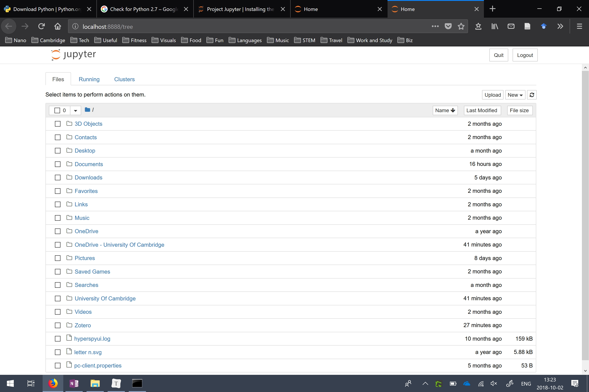
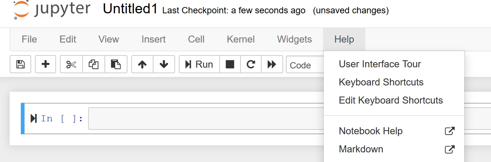

# Introduction to Python

last edit tgp27 191005

###To do before the practical

1. Attend intro lecture (15.15, Fri 11th October, Maxwell Centre)
2. Download and install Python 3
3. Download and install Jupyter Notebook
4. Learn/refresh basic operations in Python

### Install Python 3

Follow the instructions below to install the latest version of Python (3.7.4)

1. Go to https://www.python.org/downloads/
2. Download Python 3.7.4 by clicking the yellow button at the top of the page.
3. Download and open the .exe file
4. On the first window, tick the box at the bottom of the window "Add Python 3.7 to PATH". Then select "Install Now" (unless you're already familiar with Python and want to customise the installation).
5. Complete installation

#### Check Python is installed

1. Open "Run" (press the Windows key and then R or type "run" in the Windows start menu)
2. Type "cmd.exe" into "Run" to open the Windows Command Prompt (a window with white text on a black background)

3. Type "python" (lower case) on the first line. 
4. If Python's installed correctly you should see a line of text that starts with "Python 3.7.4" pop up on screen.

### Install Jupyter Notebook

Jupyter notebooks are a neat way of combining text notes and pieces of code (in Python or other programming languages). We will discuss Jupyter, and other ways to code with Python, in the intro lecture. See also http://jupyter.org/.

We will install Jupyter Notebook using a tool called pip ( https://pypi.org/project/pip/) which makes it easy to install packages (extensions) of the core Python language. Pip was automatically installed when you installed Python.

1. Go to the Windows Command Prompt (see instructions above)

2. Type the following into the command prompt:

   ```python
   python -m pip install jupyter
   ```

3. It should take a few minutes to download all the necessary components
4. To run Jupyter notebook, open the Command Prompt and type 

```
jupyter notebook
```

If successful, a new window should open:



5. Navigate to a folder (e.g. Documents).

6. Click "New" in the top right corner and select "Python 3" to create a new notebook in that folder.

    

7. A new blank notebook should now be open. Under the "Help" tab at the top of the page, you can take a tour of the Jupyter user interface, and learn more about other features (e.g. keyboard shortcuts).

8. Play around with Jupyter notebooks to familiarise yourself.

###Learn basic Python operations

Some of you may have used Python before, and some of you may be complete beginners. For you to get the most out of the Python practical, it would help if you arrived with some basic Python knowledge. To help you learn/refresh the basics, there is a crash course intro to Python notebook in the practical folder.

1. Launch Jupyter Notebook (see instructions above)
2. Navigate to the crash course intro in the Practical folder: it's in the "block notebooks" folder as a Jupyter notebook entitled "0_PythonIntro.ipynb".
3. Open the notebook and work through it. You are strongly encouraged to play around with the code: change the values in the calculations, add your own pieces of code and generally check that you understand how everything works.

